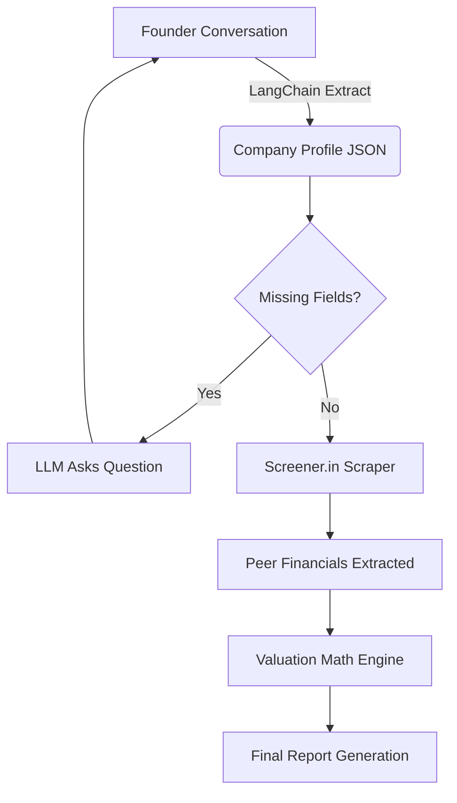

# MSME Valuation Engine

> **An institutional-grade, fully automated M&A valuation engine designed specifically for Indian MSMEs.**

## The Business Case

MSME founders are consistently priced out of professional M&A valuations, which easily cost upwards of $20,000 from traditional investment banks. Without access to institutional tools, founders are left guessing their net worth or relying on crude, inaccurate heuristics (e.g., "1x revenue"). 

This application democratizes M&A. It empowers founders to instantly calculate their company's true value by blending live stock market peer data with rigorous, audit-ready quantitative models.

---

## Technical Architecture

The system is built on **LangGraph**, providing a deterministic orchestration layer that cleanly separates unstructured LLM conversations from strict, audit-ready Python math.

### Data Flow



### Bypassing LLM Hallucinations

We do not trust LLMs to do math or guess competitors. The LLM is strictly confined to natural language extraction. Once the company profile is built, the system switches to pure deterministic Python:
1. **Screener.in Integration**: Scrapes live peer-comparison tables directly from Screener.in using a headless Chrome instance. 
2. **Hard Math**: Computes EV/EBITDA, EV/Revenue, and DCF mathematically without LLM interference.

---

## Methodology Deep Dive

We built this engine with absolute mathematical rigor. Simple averages are corruptible; our models are not.

### 1. Smart Peer Discovery & Exponential Decay
When comparing an MSME to a public peer, we don't just take an average of the peer multiples. The engine calculates a **3-Factor Distance Score** based on:
- Revenue scale
- EBITDA margins
- Year-over-Year Growth

Instead of a linear weight, we apply **Exponential Decay** (`math.exp(-distance)`). This ensures that a peer that perfectly matches the MSME is heavily weighted, while a massive outlier (e.g., a $10B mega-cap corp) is exponentially silenced.

### 2. Weighted Median (Immunization against Outliers)
Financial data is noisy. A single public peer with a 500x P/E ratio will instantly corrupt a standard average, artificially inflating the MSME's valuation by hundreds of millions. 

Our engine uses a **Cumulative Weighted Median**. By finding the 50th percentile of the exponential weights, the engine naturally ignores extreme outliers entirely, providing a robust, highly defensible multiple that a buyer will actually respect.

### 3. DCF Growth Fading
A common trap in private valuations is projecting current hyper-growth (e.g., 40% YoY) into perpetuity, resulting in a massively inflated terminal value. Our engine applies a **5-Year Linear Fade**, gradually tapering the company's current growth rate down to a realistic 4% terminal macroeconomic growth rate.

### 4. Dynamic Illiquidity Discount
Public companies are liquid; private MSMEs are not. We apply a baseline illiquidity discount (15% to 25% depending on revenue bands) and dynamically adjust it based on the company's unique fundamentals:
- **Margin Premium:** Highly profitable companies are easier to sell (reduces discount).
- **Growth Premium:** Fast growers attract buyers (reduces discount).
- **Customer Concentration Penalty:** If an MSME relies heavily on a single client, risk skyrockets (increases discount).

---

## File Structure

- `backend/app/main.py`: FastAPI entry point.
- `backend/app/agents/graph.py`: LangGraph orchestration.
- `backend/app/services/valuation.py`: Core math engine (Weighted Medians, DCF Fading, Distance Scoring).
- `backend/app/services/screener_scraper.py`: Headless Selenium scraper for live peer data.
- `backend/session_store.py`: Persistent JSON session logging.
- `frontend/`: React + Vite frontend dashboard.

---

## Running Locally

1. **Setup the environment**: Ensure you have Python 3.10+ and Node.js installed. Ensure you have your `GEMINI_API_KEY` set in `backend/.env`.
2. **Start the application**: 
   ```bash
   python run.py
   ```
3. Navigate to `http://localhost:5173` to access the dashboard.
