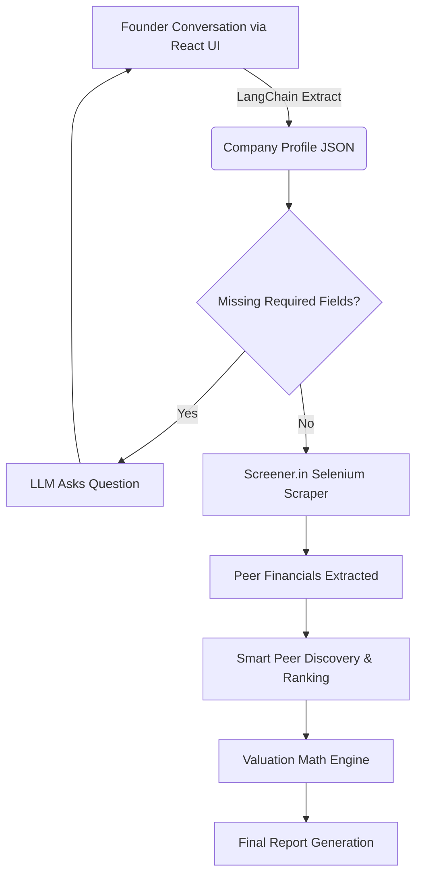

# MSME Valuation Engine

> **An institutional-grade, fully automated M&A valuation engine designed specifically for Indian MSMEs.**

---

## 1. Executive Overview

In the current M&A landscape, MSME (Micro, Small, and Medium Enterprises) founders are systematically priced out of professional valuations, which typically demand upwards of $20,000 from traditional investment banks. Consequently, founders are often left guessing their net worth or relying on crude, highly inaccurate heuristics (e.g., "1x revenue" or flat EBITDA multiples). 

This application democratizes M&A advisory. It empowers founders to instantly calculate their company's true equity value by blending live, scraped stock market peer data with rigorous, audit-ready quantitative financial models.

### Section Summary
*This tool serves as an automated investment banking analyst—providing founders with free, instantaneous, and mathematically defensible valuations to level the playing field during M&A negotiations.*

---

## 2. System Architecture & Data Flow

To ensure production-level reliability and eliminate LLM "hallucinations" in mathematical calculations, the system strictly isolates natural language processing from quantitative analysis.

The architecture relies on **LangGraph** to provide a deterministic orchestration layer. The LLM is confined entirely to the extraction of the company profile from the founder's chat. Once the quantitative parameters are extracted, the system hands off to a deterministic, pure-Python mathematical engine.

### Data Flow Diagram



### Core File Structure
- `backend/app/main.py`: The FastAPI server entry point.
- `backend/app/agents/graph.py`: LangGraph orchestration tying the LLM to the scraping scripts.
- `backend/app/services/valuation.py`: Core quantitative math engine (Weighted Medians, DCF Fading, Distance Scoring).
- `backend/app/services/screener_scraper.py`: Headless Selenium scraper for extracting live peer data.
- `backend/app/session_store.py`: Persistent JSON session logging for auditability.
- `frontend/`: React + Vite frontend dashboard.

### Section Summary
*The system uses an LLM solely for data extraction, routing the extracted financial parameters into a strict, deterministic Python pipeline that scrapes live market data and calculates the valuation without AI interference.*

---

## 3. Quantitative Methodology: Peer Discovery

To value a private company, it must be compared to public peers. However, relying on random "sector peers" is a critical flaw. A $5M manufacturing startup cannot be compared equally to a $10B mega-cap corporation.

### Peer Retrieval
When the target MSME's profile is complete, the engine spins up a headless `undetected_chromedriver` instance. It automatically navigates to **Screener.in**, searches for the MSME's closest listed equivalent, and scrapes the live "Peer Comparison" table directly from the DOM (extracting Market Cap, Debt, Sales, OPM, and P/E ratios).

### Peer Selection & Ranking (Distance Formula)
Once a universe of public peers is scraped, the engine ranks them based on financial similarity to the target MSME using a **3-Factor Distance Score**:

1. **Revenue Distance:** `|Peer_Rev - Target_Rev| / Target_Rev`
2. **Margin Distance:** `|Peer_OPM - Target_OPM|`
3. **Growth Distance:** `|Peer_Growth - Target_Growth| / Target_Growth`

**Total Distance Formula:**
`Total_Distance = (w1 * Rev_Dist) + (w2 * Margin_Dist) + (w3 * Growth_Dist)`

### Section Summary
*The engine programmatically scrapes live public peers and mathematically ranks them by financial similarity (scale, margin, and growth), ensuring the MSME is only compared to structurally identical companies.*

---

## 4. Quantitative Methodology: Final Valuation

Simple averages are easily corrupted by stock market anomalies. This engine utilizes institutional-grade quantitative math to immunize the valuation against market outliers.

### Exponential Decay Weighting
Instead of giving every peer an equal vote in the valuation, the engine applies an exponential penalty based on the Distance Score calculated above.
**Formula:** `Weight = e^(-Total_Distance)`
A peer that perfectly matches the target MSME receives a weight near `1.0`, while a massive structural outlier is exponentially silenced toward `0.0`.

### The Cumulative Weighted Median
If a single peer company trades at a massive 500x P/E ratio, it will destroy a standard average. To prevent this, the engine uses a **Weighted Median**:
1. All peers are sorted by their valuation multiple (e.g., EV/EBITDA).
2. The cumulative sum of their Exponential Weights is calculated.
3. The engine selects the multiple exactly at the 50% mark of the total weight.
This completely immunizes the final valuation against extreme outliers.

### DCF (Discounted Cash Flow) Growth Fading
A common trap in venture valuations is projecting current startup hyper-growth (e.g., 40% YoY) into perpetuity, resulting in an artificially inflated terminal value. 
The engine projects 5 years of cash flows, applying a **Linear Fade** to the growth rate. In Year 1, growth may be 40%, but by Year 5, it is linearly faded down to a terminal macroeconomic growth rate of 4%.

### Dynamic Illiquidity Discount
Public shares are highly liquid; private MSME shares are not. Buyers require an "Illiquidity Discount".
1. **Base Rate:** 15% to 25% (tiered dynamically by the MSME's revenue size).
2. **Dynamic Adjustments:** 
   - *Margin Premium:* If the EBITDA margin > 20%, the discount drops by 2.5% (highly profitable businesses are easier to sell).
   - *Concentration Penalty:* If a single client constitutes > 40% of revenue, the discount increases by 5% (high key-man risk).

### Section Summary
*The valuation engine blends live market multiples with a mathematically faded DCF, uses Weighted Medians to aggressively filter out market anomalies, and applies a dynamic private-company discount to arrive at a hyper-realistic target price.*

---

## 5. Configuration & Deployment

To run this project in a production or local environment, the `.env` file in the `backend/` directory must be properly configured.

### Environment Variables (`backend/.env`)

| Variable | Description | Required? |
|----------|-------------|-----------|
| `GROQ_API_KEY` | Your Groq API key used by LangGraph to extract data from the founder's conversation. | **Yes** |
| `SCREENER_USERNAME` | Your Screener.in login email. Required to bypass login walls and extract premium financial metrics. | *Optional but Recommended* |
| `SCREENER_PASSWORD` | Your Screener.in password. | *Optional but Recommended* |
| `CHROME_BINARY` | Absolute path to your Chrome/Chromium executable. If left blank, the `run.py` script attempts to auto-detect it. | *Optional* |

### Local Execution Instructions

1. **Clone the repository** and navigate to the root directory.
2. **Configure the Environment**:
   ```bash
   cp backend/.env.example backend/.env
   # Open backend/.env and populate your GROQ_API_KEY and SCREENER credentials.
   ```
3. **Start the Application** (This script will spin up both the FastAPI backend and Vite frontend concurrently):
   ```bash
   python run.py
   ```
4. **Access the UI**: Navigate to `http://localhost:5173` in your browser.

### Section Summary
*Configuration requires a standard `.env` setup for API keys and scraping credentials. The application is designed to be easily booted via a unified Python script that manages both backend and frontend processes.*
