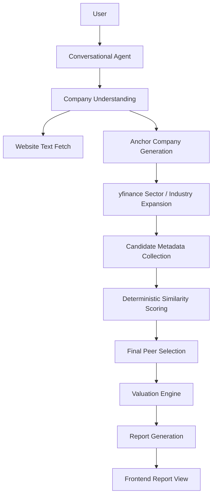
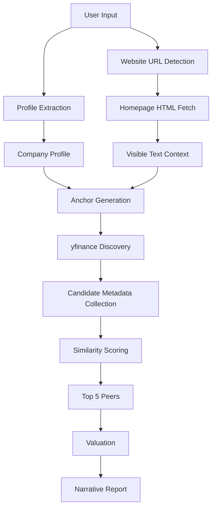

# MSME Valuation Agent

Conversational valuation agent for Indian MSMEs. It interviews a founder, ingests a company website when one is provided, discovers real listed peers through deterministic yfinance expansion, computes valuation in pure Python, and explains the result in plain English.

The important constraint is unchanged: the LLM never performs valuation math or final peer ranking. It is used for conversation, structured extraction, website-aware company understanding, and anchor-company suggestions. The final peer set is selected deterministically from yfinance data.

## 1. Executive Summary

This project estimates the valuation of a private Indian MSME by combining founder input, website text, live listed-company data, and deterministic valuation math.

It exists because free real-time financial data for private Indian companies does not really exist. The defensible alternative is to infer the business, find public listed comparables, pull live market and financial data from yfinance, and apply a disclosed private-company discount.

The valuation methodology is:

- EV/EBITDA when usable peer EBITDA multiples exist
- EV/Revenue as a fallback when EBITDA multiples are unavailable
- Median peer multiple as the central estimate
- P25/P75 peer multiples for the valuation range
- A fixed private-company discount applied after subtracting debt

## 2. System Architecture



Component responsibilities:

- Conversational Agent: asks for missing company facts and handles the interview loop.
- Company Understanding: extracts structured fields from chat and website text.
- Website Text Fetch: fetches the provided homepage HTML and extracts readable text.
- Anchor Company Generation: asks the LLM for 3–5 public anchor companies to seed discovery.
- yfinance Expansion: uses the anchor companies to expand the candidate universe through yfinance sector and industry discovery.
- Candidate Metadata Collection: pulls live financial and company metadata from yfinance.
- Deterministic Similarity Scoring: ranks candidates with fixed weighted rules.
- Valuation Engine: computes the valuation numbers deterministically.
- Report Generation: narrates the already-computed valuation in markdown.

## 3. End-to-End Workflow

1. The frontend creates a session by calling `POST /api/session`.
2. The backend starts the interview and returns the opening question.
3. The user replies in chat.
4. The backend reprocesses the full conversation and extracts structured company fields.
5. If the user includes a website URL, the backend fetches that homepage and extracts visible text for reference.
6. The LLM may suggest 3–5 anchor companies, but those anchors are only used to expand the candidate universe.
7. yfinance is queried for sector and industry metadata around the anchors.
8. The candidate universe is built from yfinance discovery results and anchor fallback logic.
9. Each candidate is queried through yfinance for live financial and business metadata.
10. Candidates are scored deterministically.
11. The top 5 peers are passed to the valuation engine.
12. The valuation engine computes EV, equity value, discount, and range.
13. The LLM writes the final markdown report from the computed numbers and the peer-discovery notes.

## 4. Data Flow Diagram



Data transformations:

- Chat text becomes structured fields.
- Website HTML becomes compact reference text.
- LLM anchor suggestions become seed companies.
- yfinance discovery becomes a candidate universe.
- Candidate metadata becomes peer records.
- Peer records become weighted similarity scores.
- The ranked peers become valuation inputs.
- Valuation results become the final report.

## 5. Filesystem Structure

```text
backend/
  app/
    main.py              FastAPI app, CORS, and static file serving (frontend/dist)
    config.py            Environment variables and TLS-related setup
    models.py            Pydantic models
    session_store.py     In-memory session storage
    agents/
      gemini_client.py   Groq-hosted OpenAI-compatible LLM wrapper
      graph.py           LangGraph orchestration
      prompts.py         LLM prompts
    services/
      website_context.py Homepage URL detection and text extraction
      peer_discovery.py  Anchor generation, candidate discovery, ranking
      yfinance_service.py Live ticker financial metadata
      valuation.py       Deterministic valuation math
      nse_scraper.py     Legacy NSE candidate helper; no hardcoded universe is used in the new pipeline
    routes/
      session.py         Session creation endpoint
      chat.py            Chat endpoint
  tests/
    test_valuation.py
    test_peer_discovery.py
    test_website_context.py

frontend/
  dist/                   Pre-built production bundle (served by the backend)
    index.html
    assets/               JS and CSS bundles
  src/
    api/client.ts        Frontend API types and fetch helpers
    components/
      ChatWindow.tsx     Chat UI
      MessageBubble.tsx  Message rendering
      ReportView.tsx     Valuation report UI
    App.tsx              App shell and session bootstrap
    main.tsx             React entry point
    index.css            Styling
```

## 6. Component Documentation

### Conversational Agent

Purpose: interview the founder and collect the minimum required data.

Inputs: conversation history, current partial profile, optional website context.

Outputs: next assistant message or report-ready state.

Logic: the graph re-extracts structured data from the whole conversation each turn.

### Profile Extraction

Purpose: convert free text into structured company attributes.

Inputs: conversation history and website text.

Outputs: `CompanyProfile` fields.

Logic: the extraction prompt asks for all fields that can be inferred confidently. Website text is included as reference context when available.

### Peer Discovery

Purpose: build a deterministic peer set from public market data.

Inputs: `CompanyProfile`, optional website context.

Outputs: anchor companies, candidate universe notes, ranked peers, similarity rationale.

Logic: LLM anchors expand into yfinance sector/industry discovery, candidates are scored deterministically, and the top 5 are selected.

### Valuation Engine

Purpose: compute the valuation numbers.

Inputs: profile and selected peers.

Outputs: valuation result with range and methodology notes.

Logic: median peer multiples, debt subtraction, private-company discount, percentile range.

### Report Generator

Purpose: narrate the already-computed valuation.

Inputs: profile, peers, valuation JSON, website context.

Outputs: markdown report text.

Logic: the report is descriptive only and is not allowed to recalculate numbers.

## 7. Peer Discovery Documentation

This is the most important architecture change.

### What changed

The old approach used sector keyword matching and hardcoded ticker lists. That is gone from the final pipeline.

The new pipeline is:

```text
Company profile + website text
→ LLM anchor companies
→ yfinance sector / industry discovery
→ candidate universe
→ candidate metadata collection
→ deterministic similarity scoring
→ top peers
```

### Step 1: Company understanding

`CompanyProfile` now includes optional fields for:

- `industry`
- `sub_industry`
- `customer_type`
- `competitors`
- `keywords`
- `geography`

These are optional. The interview still requires only:

- company name
- sector
- revenue
- EBITDA
- debt
- city

### Step 2: Anchor company generation

The LLM is asked for 3–5 publicly traded anchor companies.

Anchors are not final peers. They only seed the candidate universe.

If the LLM fails, the system falls back to deterministic anchors from the founder profile or mentioned competitors.

### Step 3: yfinance discovery

For each anchor:

- resolve a ticker if needed with yfinance search
- inspect `ticker.info`
- read `sectorKey` and `industryKey`
- expand with `yf.Sector(sectorKey)` and `yf.Industry(industryKey)`
- collect candidate tickers from top-companies lists

The candidate universe is deduplicated and normally lands in the 20–100 range, but the system never fails if it is smaller.

### Step 4: candidate metadata collection

For every candidate ticker, the system collects live yfinance metadata including:

- ticker
- company name
- sector
- industry
- market cap
- enterprise value
- total revenue
- EBITDA multiple
- revenue multiple
- EBITDA margin
- revenue growth
- country
- long business summary
- employee count

Candidates that fail retrieval are skipped.

### Step 5: similarity scoring

The final similarity score is a weighted value in the range $[0,1]$.

Weights:

- Industry similarity: 40%
- Revenue similarity: 20%
- EBITDA margin similarity: 10%
- Geography similarity: 10%
- Description similarity: 20%

#### Revenue similarity

Uses logarithmic distance:

$$
score = \frac{1}{1 + |\log(1 + r_t) - \log(1 + r_c)|}
$$

where $r_t$ is target revenue and $r_c$ is candidate revenue.

#### Description similarity

Uses `sklearn.feature_extraction.text.TfidfVectorizer` and cosine similarity.

The corpus contains:

- target company description
- all candidate descriptions

No embeddings. No vector database.

#### Geography similarity

- same country: 1.0
- same region: 0.5
- different region: 0.2

### Step 6: ranking

Candidates are sorted by final score descending.

The top 5 become the peer set for the valuation engine.

Each peer stores:

- similarity score
- ranking rationale

### Step 7: explainability

Methodology notes now include:

- anchor companies selected
- sector/industry keys used
- candidate universe size
- final ranking rationale
- why the final peers were selected

### Step 8: fallback logic

The pipeline never crashes just because discovery is weak.

Fallback rules:

- if industry discovery fails, use anchors directly
- if sector discovery fails, use anchors directly
- if the candidate universe is smaller than 5, use anchors directly
- if candidate retrieval fails, skip the bad ticker and continue
- if at least one ticker has usable financial data, valuation can proceed

### Important limitation

This project does not do browser-rendered, interactive, JS-heavy website crawling. It fetches the provided homepage HTML and extracts visible text. That is deliberate: it keeps the pipeline deterministic and auditable.

## 8. Valuation Methodology

The valuation engine is unchanged and remains deterministic.

### EV/EBITDA

If usable peer EV/EBITDA multiples exist:

$$
EV = median(peer\ multiples) \times target\ EBITDA
$$

### EV/Revenue fallback

If EBITDA multiples are unavailable:

$$
EV = median(peer\ EV/Revenue) \times target\ revenue
$$

### Equity value

$$
Equity\ value\ pre-discount = EV - debt
$$

### Private-company discount

The equity value is then reduced by the configured private-company discount.

### Range

The low and high range are computed using peer P25 and P75 multiples, then the same debt subtraction and discount logic is applied.

## 9. Data Sources

- yfinance: live listed-company financials and sector/industry discovery.
- Groq OpenAI-compatible API: conversation, extraction, anchor-company generation, and report narration.
- Company website URL provided by the user: homepage text reference.

No vector database is used.

No manually maintained peer database is used in the new pipeline.

## 10. LLM Responsibilities

The LLM does:

- conversation
- structured extraction
- website-aware company understanding
- anchor-company suggestions
- report narration

The LLM does not:

- calculate valuation math
- select final peers
- apply score weights
- decide the final valuation range

## 11. Configuration

### Backend

Environment variables (set in `backend/.env`):

- `GROQ_API_KEY`
- `GROQ_MODEL`

Local backend run:

```bash
cd backend
./.venv/Scripts/python.exe -m uvicorn app.main:app --host 127.0.0.1 --port 8001 --reload
```

The backend serves both the API and the pre-built frontend from `frontend/dist/`. Open `http://127.0.0.1:8001` in a browser — no separate frontend server needed.

### Frontend (development only)

If Node.js is available and you want to run the frontend dev server with hot reload:

```bash
cd frontend
npm install
set VITE_BACKEND_URL=http://127.0.0.1:8001
npm run dev
```

The Vite dev server proxies `/api` calls to the backend.

> **Note:** Node.js is **not** required to run the app. The production build is already included in `frontend/dist/` and is served directly by the FastAPI backend. The `start.bat` script launches everything with just Python.

This laptop uses port 8001 because port 8000 is occupied by another Windows service.

### Runtime requirements

- Python 3.12+
- Windows certificate store trust for local TLS-inspecting networks
- (Optional) Node.js 22.x — only needed for frontend development / rebuilding `frontend/dist/`

## 12. Testing

Backend tests:

```bash
cd backend
./.venv/Scripts/python.exe -m pytest -q
```

Current coverage includes:

- valuation math
- peer discovery ranking logic
- website URL extraction and homepage text extraction

Frontend build (requires Node.js — only needed if modifying frontend source):

```bash
cd frontend
npm run build
```

## 13. Design Decisions

- The website fetcher is homepage-only and HTML-based. That keeps the system deterministic and avoids introducing a browser automation dependency.
- Final peer selection is deterministic. The LLM can suggest anchors, but it never picks the final set.
- yfinance remains the only financial data source.
- TF-IDF is used for text similarity because it is explainable and lightweight.
- The valuation engine was intentionally left untouched to preserve auditability.

## 14. Future Improvements

- Better anchor fallback when the LLM fails to produce usable company names.
- Stronger yfinance search disambiguation for companies with many tickers.
- Optional browser-rendered website capture for JS-heavy company sites, if that ever becomes worth the complexity.
- More test coverage for yfinance discovery edge cases.
- Smarter geography normalization if the project later needs more global peer coverage.
